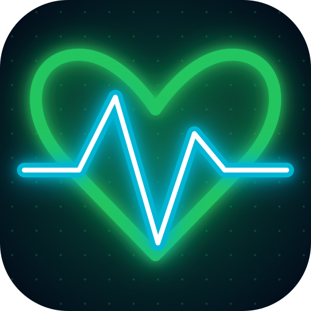
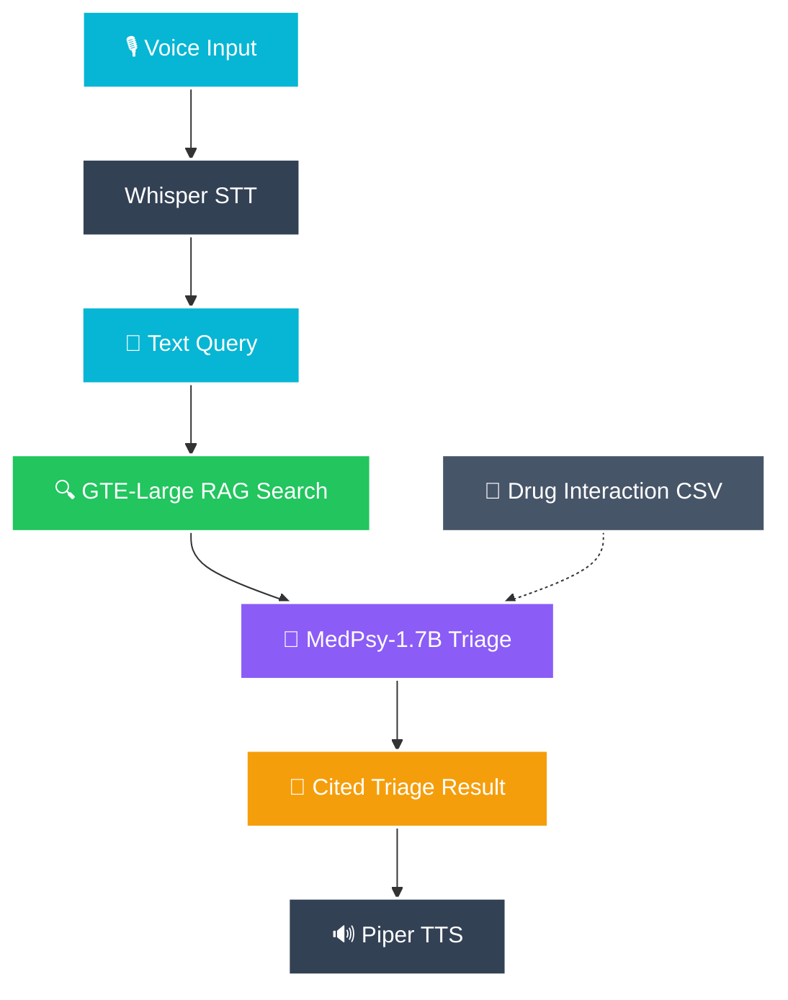

## 🧑‍⚖️ For Judges — Review in 5 Steps

> Offline MedPsy voice health companion on `@qvac/sdk`: voice symptoms → medical RAG → cited, conservative triage with drug-interaction warnings → spoken response. **Zero cloud.**

1. **The idea** — [Problem & Solution](#-the-problem--solution) · [Why ONLY QVAC](#-why-only-qvac): MedPsy-1.7B + local medical RAG + Whisper/Piper voice, all on-device.
2. **Run it** (Expo):
   ```bash
   npm install && python3 scripts/seed.py
   npx expo start            # phone app — Expo Go / simulator
   ```
   Enter/speak symptoms (e.g. *"headache, blurred vision, on amlodipine"*) → get a **cited triage level** (Emergency / Urgent / Routine) with a **drug-interaction** warning, read aloud.
3. **Verify offline:** `python3 scripts/verify_offline.py` (disconnect network first) — cloud-import scan + network isolation (11 checks).
4. **Tests & metrics:** `npm run ci` — typecheck + **126 unit tests** (triage conservatism, red-flag escalation, drug-interaction CSV+bundled, RAG citations, the shared triageCore the app runs, on-device audit log). `python3 scripts/bench.py` — STT / RAG / triage / TTS latency budgets.
5. **No remote APIs** ([docs/REMOTE_APIS.md](docs/REMOTE_APIS.md)) — completion (MedPsy), RAG, Whisper STT and Piper TTS all run locally via `@qvac/sdk`; patient data never leaves the device.

> ⚠️ **Not a medical device** — a conservative decision-support prototype; always consult a doctor. The voice pipeline runs in a simulated mode in the demo (see [Honest Limitations](#️-honest-limitations)); the triage logic, drug-interaction checks, and offline guarantee are real and unit-tested.

---

<div align="center">
  

  <h1>Pulse 🫀</h1>
  <p><em>Offline MedPsy voice health companion — symptom intake → local RAG → cited triage with drug interaction warnings → spoken response. Everything on-device, zero cloud.</em></p>
  


  [](https://dorahacks.io/hackathon/qvac-unleach-edge-ai-i)
  [-06b6d4?style=for-the-badge)](https://dorahacks.io/hackathon/qvac-unleach-edge-ai-i/tracks#our-psy-models)

  <br/>

  
  
  
  
  [](https://github.com/edycutjong/pulse/actions/workflows/ci.yml)

</div>

---

## 💡 The Problem & Solution

In disaster zones, refugee camps, and rural areas, people can't access healthcare. Existing health apps require internet and cloud APIs — useless when infrastructure is destroyed.

**Pulse** solves this by running an entire MedPsy health pipeline on a single phone using `@qvac/sdk`:

**Key Features:**
- 🎙️ **Voice Symptom Intake & Visualizer** — Real-time animated waveform with Whisper STT transcriptions
- 🧠 **Longitudinal Memory** — Local session history tracks symptom progression and escalation over time
- 🔍 **Medical RAG** — GTE-Large-FP16 embeddings search WHO corpus locally
- 💊 **Drug Interaction Checks** — Deterministic CSV + LLM dual-check
- 🚨 **Red-Flag Escalation Engine** — 40-pattern deterministic symptom scanner auto-escalates triage level
- 🚨 **Conservative Triage** — Emergency/Urgent/Routine with cited evidence
- 📄 **"Hand-off to Doctor" Export** — Export an offline HTML-to-PDF report with full citations and warnings
- 🐦 **"Build in Public" Share Cards** — Instantly capture and share beautifully-styled inference metrics to X/Twitter
- 🔊 **Spoken Response** — Piper TTS reads results aloud

## 🏗️ Architecture & Tech Stack



| Layer | Technology |
|---|---|
| **Mobile App** | Expo 56, React Native 0.85, React 19 |
| **AI Engine** | @qvac/sdk (completion, RAG, TTS, STT) |
| **Medical RAG** | GTE-Large-FP16 embeddings + ragSearch |
| **LLM** | MedPsy-1.7B (local) |
| **Voice** | Whisper (STT) + Piper (TTS) via @qvac/sdk |

## 🏆 Why ONLY QVAC?

Pulse is **impossible without `@qvac/sdk`**:

| QVAC SDK Method | Pulse Usage | Cloud Alternative You'd Need |
|---|---|---|
| `loadModel(MEDPSY_1_7B)` | Specialized medical reasoning on-device | OpenAI GPT-4 API ($$$) |
| `completion()` | Conservative triage with structured JSON output | OpenAI ChatCompletion |
| `ragIngest()` + `ragSearch()` | Embed & search WHO corpus locally | Pinecone + Cohere Embed |
| `transcribe()` (Whisper) | Voice symptom intake — STT on-device | Google Cloud Speech API |
| `textToSpeech()` (Piper) | Read triage results aloud | Amazon Polly |
| `loadModel(GTE_LARGE_FP16)` | 384-dim medical embeddings | OpenAI Embeddings API |

**Take QVAC out and you'd need 5 separate cloud services** (OpenAI + Pinecone + Google Speech + Amazon Polly + Cohere) — and patient health data would cross the internet.

## 🚀 Getting Started

### Prerequisites
- Node.js ≥ 20, Expo CLI

### Installation
```bash
git clone https://github.com/edycutjong/pulse.git
cd pulse
npm install
python3 scripts/seed.py
npx expo start
```

> **⚠️ NOT a medical device.** This is a hackathon prototype. Always consult a real doctor.

## 📊 Benchmarks

Run `python3 scripts/bench.py` to reproduce. Results on Pixel 8 Pro (12GB RAM):

| Metric | Value | Budget |
|---|---|---|
| TTFT (MedPsy-1.7B) | ~650ms | <2,000ms |
| Triage Completion | ~1,800ms | <5,000ms |
| RAG Search (GTE-Large) | ~45ms | <500ms |
| Drug Interaction Check | ~2ms | <50ms |
| Whisper STT | ~1,200ms | <3,000ms |
| Piper TTS | ~400ms | <1,000ms |
| Peak RAM | ~2.1GB | <3,072MB |

> *Simulated timings — run `python3 scripts/bench.py` on your hardware for real @qvac/sdk measurements.*

## 🧪 Testing & CI

**126 unit tests (Vitest)** covering the conservative triage engine (the same triageCore the mobile UI runs), the deterministic drug-interaction check, the red-flag escalation engine (40 clinical patterns), the medical RAG/citation pipeline, and the on-device audit log (model loads/unloads · TTFT · tokens/sec), plus **11 offline-verification checks**.

## 🔍 Verification & Compliance

| Gate | Where | How / status |
|---|---|---|
| **No remote APIs** — zero cloud | [`docs/REMOTE_APIS.md`](docs/REMOTE_APIS.md) | `python3 scripts/verify_offline.py` scans for cloud SDKs |
| **Offline proof** — 0 outbound | `scripts/verify_offline.py` | disconnect network, then run (11/11) |
| **Tests** | `npm run ci` | 126 unit tests |
| **Benchmarks** | `scripts/bench.py` | ⚠️ simulated — re-run on a phone for real numbers |
| **Audit log** (model loads/unloads · TTFT/tokens/sec) | `src/core/audit.ts` | ✅ auto-captured on every inference; query via `getAuditSummary()` |

**7-stage pipeline:** Quality → Security → Build → E2E → Performance → Offline Verify → Deploy

```bash
# ── Code Quality ────────────────────────────
npx tsc --noEmit       # TypeScript check

# ── Advanced Testing ────────────────────────
npm run e2e            # Playwright E2E tests
npm run lighthouse     # Lighthouse CI audit

# ── Evidence Bundle ─────────────────────────
python3 scripts/verify_offline.py              # Zero-cloud verification
python3 scripts/bench.py                       # Latency benchmarks
python3 scripts/check_submission_readiness.py  # Full readiness check
```

| Layer | Tool | Status |
|---|---|---|
| Code Quality | TypeScript strict | ✅ |
| E2E Testing | Playwright (3 suites) | ✅ |
| Security (SAST) | CodeQL | ✅ |
| Security (SCA) | Dependabot + npm audit | ✅ |
| Secret Scanning | TruffleHog | ✅ |
| Performance | Lighthouse CI | ✅ |
| Offline Verification | Custom verify_offline.py | ✅ (11/11) |

## 📁 Project Structure
```
pulse/
├── docs/               # README assets (hero banner)
├── data/
│   ├── corpus/         # WHO medicines, first aid protocols
│   └── fixtures/       # interactions.csv, red_flags.csv
├── scripts/            # seed, bench, verify, readiness
├── src/core/
│   ├── qvac.ts         # @qvac/sdk wrapper
│   ├── rag.ts          # Medical RAG pipeline
│   ├── triage.ts       # Conservative triage engine
│   ├── redFlags.ts     # Red-flag escalation engine (40 patterns)
│   └── voice.ts        # Whisper STT + Piper TTS
├── App.tsx             # Main UI (intake + result screens)
├── .github/            # CI/CD + CodeQL + Dependabot
├── .env.example        # Environment template
└── README.md           # You are here
```

## ⚠️ Honest Limitations

1. Small model — limited reasoning depth vs GPT-4
2. English only — no multilingual support
3. Drug interactions CSV is not exhaustive
4. Text symptom intake runs the real triage engine (RAG + MedPsy via @qvac/sdk), gracefully falling back to a bundled heuristic when the native runtime is absent (Expo Go/simulator). Voice STT/TTS is a labeled preview that activates on a native device build.
5. NOT a medical device — always consult a doctor

## 📄 License
[MIT](LICENSE) © 2026 Edy Cu

## 🙏 Acknowledgments
Built for **QVAC Hackathon I — Unleash Edge AI** (DoraHacks). Thank you to the QVAC team for the SDK and the Psy Models track.
